# Narrativa — Smart Digital Library Platform

Narrativa is a modern web application built using C# (ASP.NET Web Forms) and SQL Server. The platform is designed to provide a complete digital library solution that allows users to browse books, manage personal libraries, and explore academic resources through a structured and user-friendly interface.

This project demonstrates practical full-stack development skills, including database integration, authentication systems, CRUD operations, book management features, and responsive user interface design.

---

# Project Overview

Narrativa provides a complete environment that enables users to discover books, explore detailed book information, manage personal collections, and access academic resources through a centralized digital platform.

The platform features a modern user-friendly interface and a secure authentication system to ensure a smooth and reliable user experience.

This project addresses the challenge of organizing and accessing educational resources by providing an efficient digital library solution for students and book enthusiasts.

---

# Project Preview

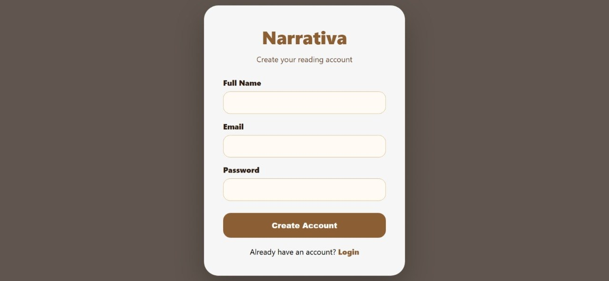

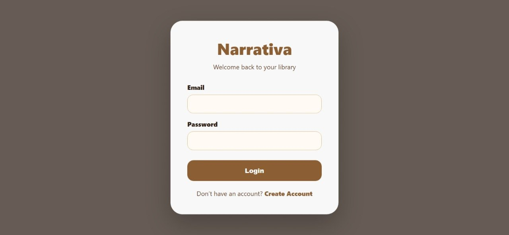

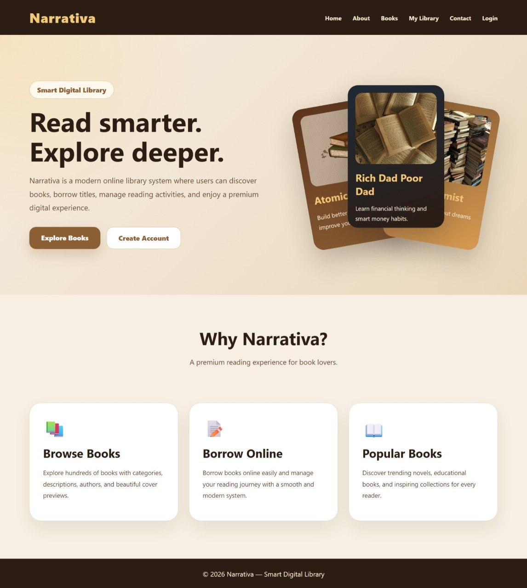

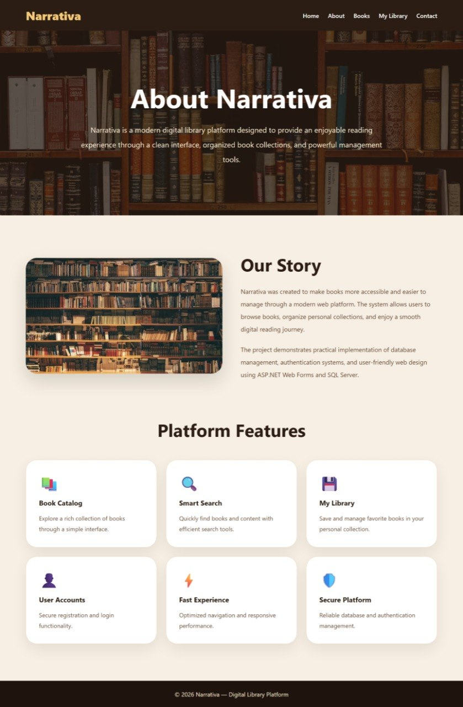

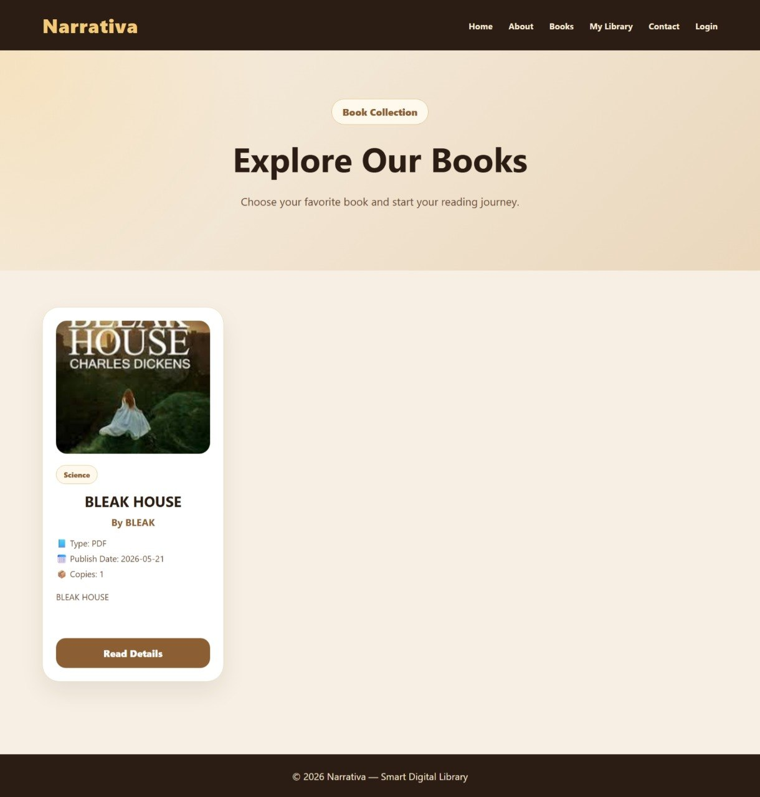

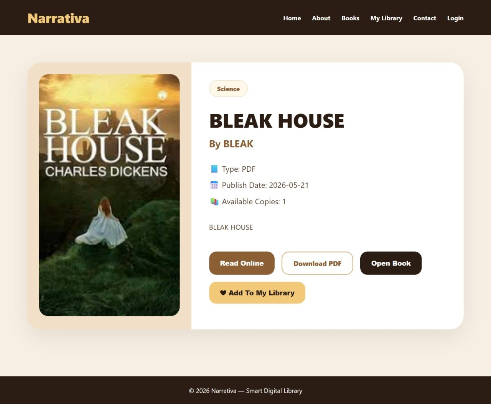

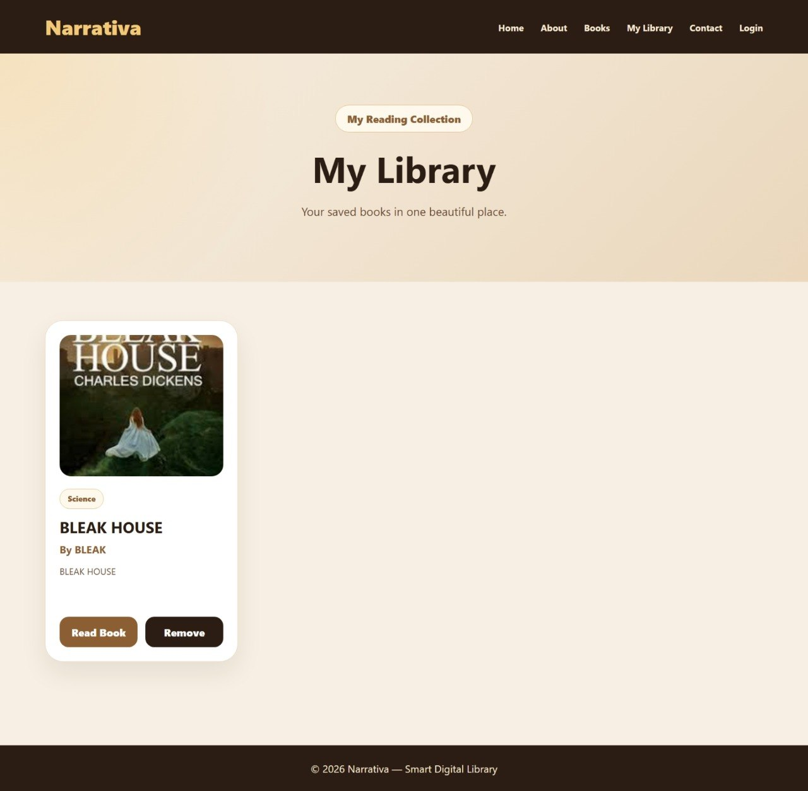

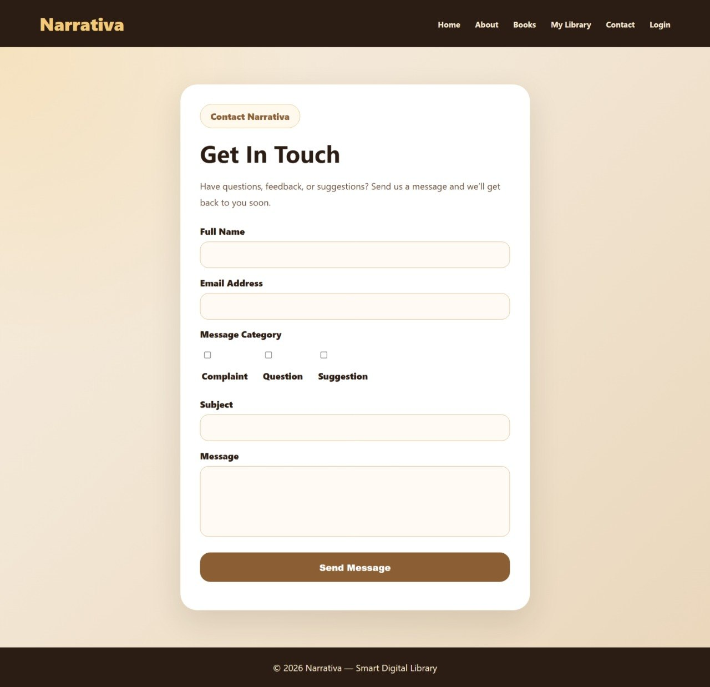

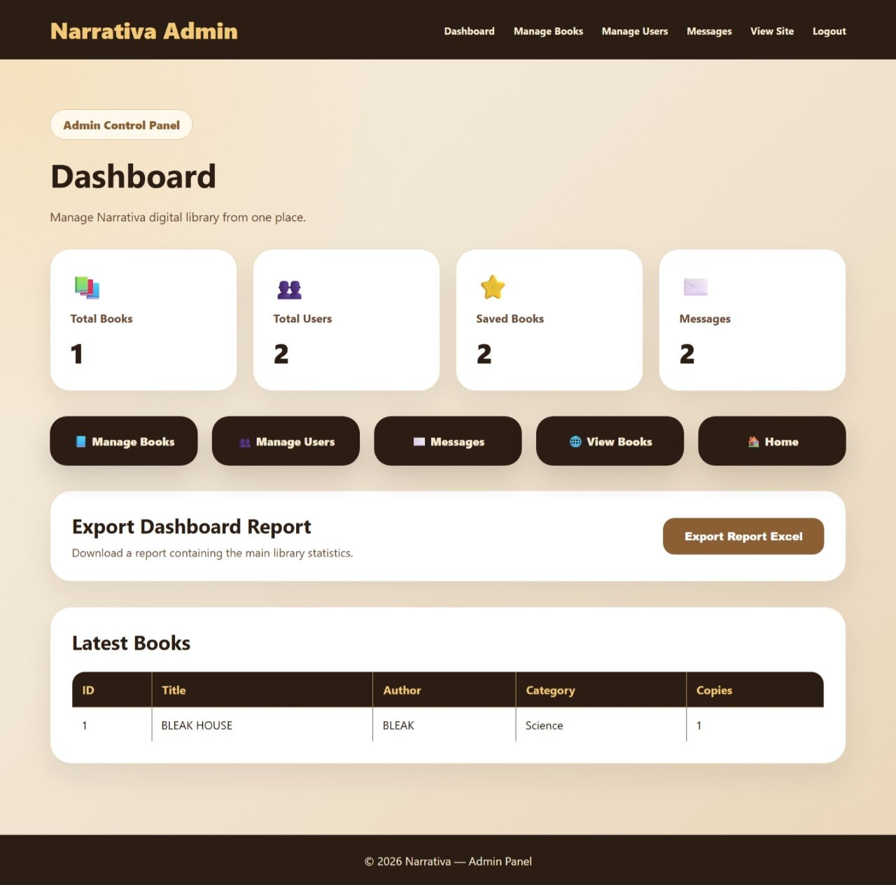

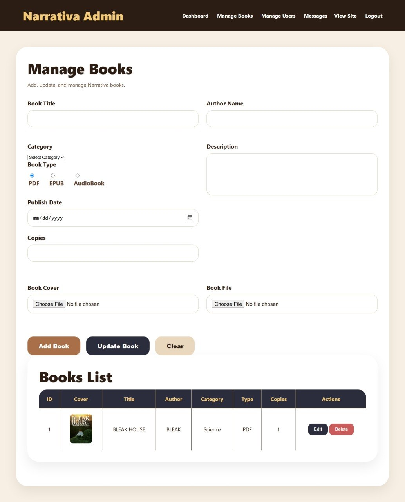

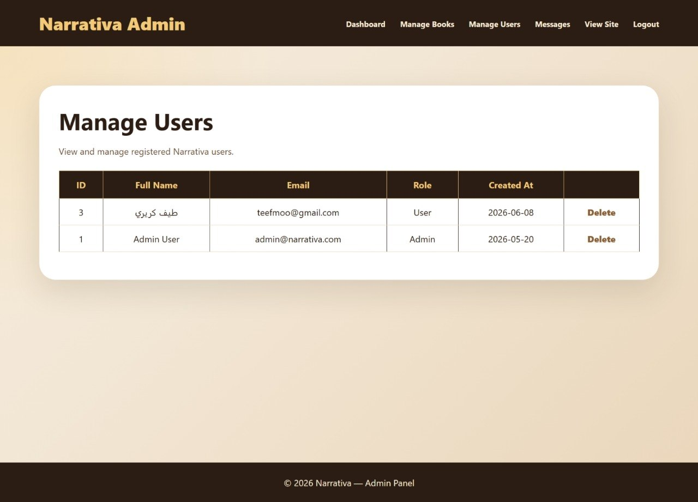

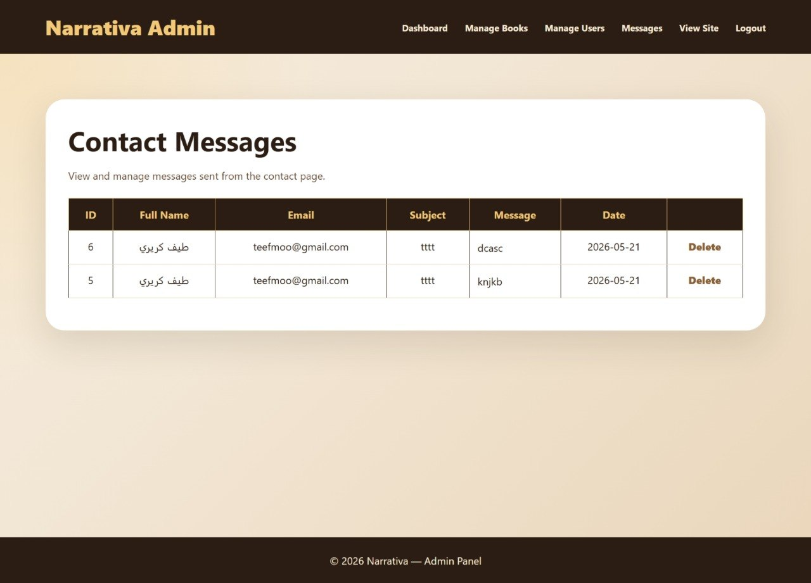

---

# Technologies Used

C# (ASP.NET Web Forms)

Used to build the core system logic, authentication workflow, and backend operations.

SQL Server

Stores all system data, including users, books, categories, and library records.

ADO.NET

Manages database connections and CRUD operations between the application and SQL Server.

Visual Studio

Serves as the primary IDE for developing, testing, and debugging the application.

---

# Key Features

User Registration and Login

Secure authentication system that supports account creation and login for platform users.

Browse Books

Users can explore available books with detailed information and book cover images.

Book Management System

Allows users to add, update, delete, and manage books efficiently.

My Library

Users can organize and manage their personal book collections through a dedicated library page.

Search and Filtering

Provides efficient search functionality to quickly locate books and resources.

Book Details Page

Displays complete information about each book, including descriptions and related details.

Contact Support Form

Built-in communication form for inquiries, suggestions, and support requests.

Admin Dashboard

Provides administrators with full control over managing books and platform content.

Full CRUD Book Management

Administrators can create, update, delete, and manage books through a dedicated management panel.

Library Organization

Books are structured and categorized to improve accessibility and user experience.

---

# What This Project Demonstrates

• Ability to build complete real-world systems using C# and SQL Server.

• Experience implementing authentication, CRUD operations, and database integration.

• Strong understanding of database design and data management.

• Skill in developing modern multi-page web applications.

• Practical experience in designing user-friendly interfaces and digital library systems.

• Capability to organize, develop, and deliver a functional full-stack project.

---

# Developer

Teef M. Karyry — TeefDev
